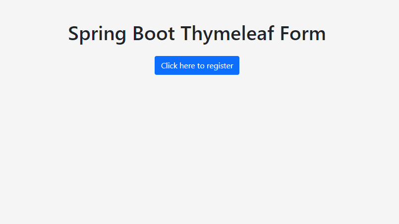
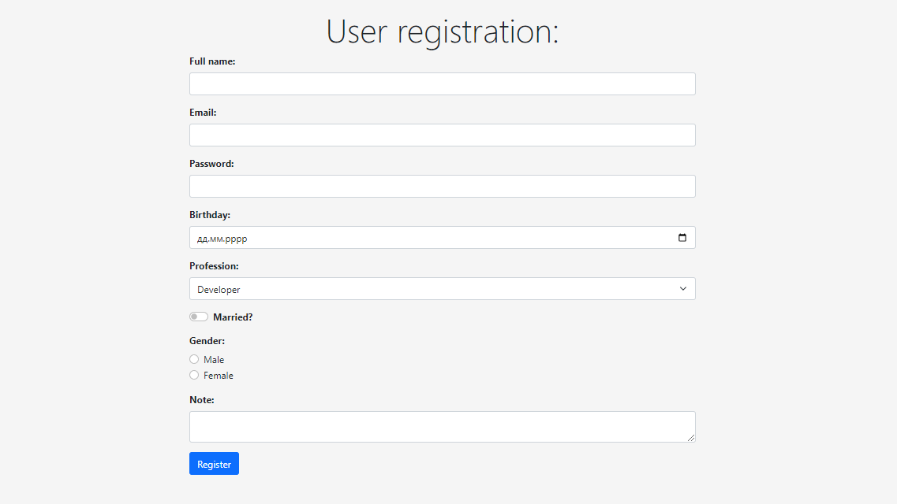
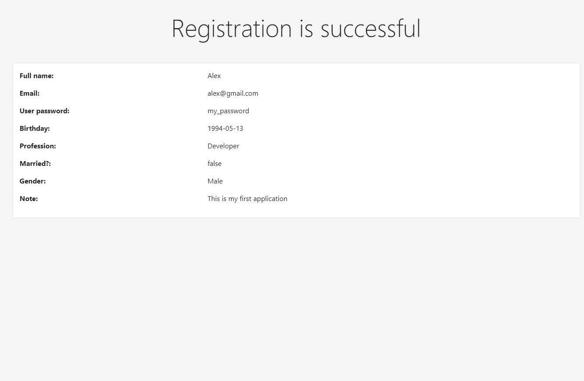

The goal of the project: create a form for user registration using such technologies as Spring Boot, Spring MVC, Thymeleaf and Bootstrap

Project description: Design according to the Spring MVC pattern, where RestController is a controller that is responsible for processing requests from the user and interacting with services and models to send a response to the user in the form of a display. As a model, this is the User class. View is three HTML files that are responsible for displaying information
''
''
''